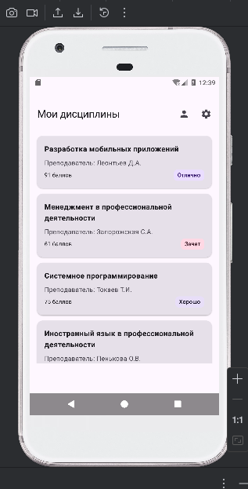
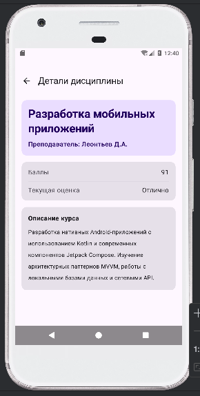
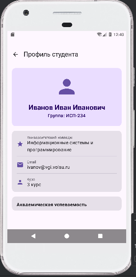
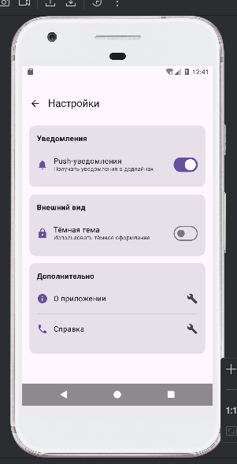

# Student Planner

## Описание приложения

Приложение "Student Planner" — это студенческий планер для отслеживания учебных дисциплин. Оно позволяет просматривать список предметов, детальную информацию о каждом курсе, а также содержит профиль студента и экран настроек. Приложение разработано с использованием современного подхода к навигации Jetpack Compose Navigation.

## Реализованные экраны

1. **Главный экран (HomeScreen)** — отображает список всех дисциплин в виде карточек
2. **Экран деталей (DetailsScreen)** — показывает подробную информацию о выбранной дисциплине
3. **Экран профиля (ProfileScreen)** — содержит информацию о студенте
4. **Экран настроек (SettingsScreen)** — позволяет настроить уведомления и тему приложения

## Используемые технологии

- **Kotlin**
- **Jetpack Compose**
- **Navigation Compose**
- **Material Design 3**

## Схема навигации
Home - главный экран
Details — при клике на карточку
Profile — при клике на иконку профиля
Settings — при клике на иконку настроек

## Скриншоты

## Контрольные вопросы

### 1. Что такое NavController и для чего он используется?

NavController — это штука, которая управляет переходами между экранами. Он знает, какой экран сейчас открыт, и помогает переключаться между ними. А rememberNavController нужен, чтобы этот контроллер не терялся при обновлении экрана.

---

### 2. Как передать параметр в маршрут навигации?

Сначала в маршруте экрана указывается место для параметра, например `details/{id}`. При переходе на это место подставляется конкретное значение, например `details/5`. А на самом экране это значение забирается и используется. Обязательные параметры должны передаваться всегда, а опциональные — могут и отсутствовать.

---

### 3. Зачем использовать sealed class для маршрутов?

Чтобы не ошибаться в названиях экранов. Вместо того чтобы писать строки вручную (и случайно опечататься), все маршруты хранятся в одном месте. IDE сама подсказывает, какие экраны есть, и не даст написать что-то несуществующее.

---

### 4. Что такое Back Stack и как им управлять?

Back Stack — это история посещённых экранов. Например, ты зашёл на главный экран, потом в профиль, потом в настройки. Стек будет: главный → профиль → настройки. Когда нажимаешь "Назад", последний экран убирается, и ты возвращаешься на предыдущий. Всё как в браузере.

---

### 5. Как работает startDestination в NavHost?

startDestination указывает, какой экран открывать первым при запуске приложения. Обычно это главный экран. Изменить его можно, например, если пользователь не залогинен — запускать экран входа, а если залогинен — сразу главный.

---

### 6. Что произойдёт, если навигаровать на несуществующий маршрут?

Приложение упадёт с ошибкой, потому что оно не знает, куда переходить. Чтобы такого не случалось, и используют sealed class — он не даст написать неправильный маршрут.

---

### 7. Зачем нужен параметр launchSingleTop в навигации?

Чтобы не создавалось много одинаковых экранов подряд. Например, если ты несколько раз кликнешь на одну и ту же дисциплину, без launchSingleTop в стеке появится куча одинаковых экранов. Придётся много раз нажимать "Назад", чтобы вернуться. С launchSingleTop такого не происходит — если экран уже открыт, новый не создаётся.

